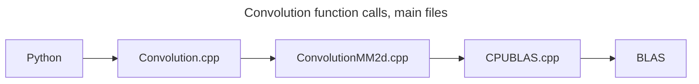

 # Understanding Torch Architecture

## 1.0 Understanding the code, structured vs unstructured kernels

Structured kernels are the newer approach to writing operations in PyTorch. They simplify the process by generating much of the associated boilerplate code through code generation.

While structured kernels provide a clean and consistent way to handle many operations in PyTorch, some operations, like convolutions, remain as direct implementations due to historical reasons and the need for highly optimized and flexible code. For instance, convolutions often directly utilize platform-specific libraries like MKL-DNN (oneDNN) for CPU or cuDNN for CUDA. These libraries have their own optimized routines that might not fit neatly into the structured kernel framework involving separate *meta* and *impl* functions.

Finally, as mentioned, some operations in PyTorch are implemented directly within the framework, while others leverage specialized libraries. For example, standard convolutions often utilize BLAS libraries for their implementation, whereas depthwise convolutions have custom implementations in PyTorch.

A general guideline to determine the implementation location is as follows:

- Generic Math Operations (e.g., convolution as matrix multiplication):
  - You'll likely eventually be shipped to a math/specific library or backend such as BLAS.
- Specific, Custom Implementations:
  - Likely found within PyTorch's native codebase, often in the `/native` directory. 

For functions defined inside pytorch, what generally happens is that the code trace will eventually land inside ```/native```, and this will be re-routed to one of backend folders, and you can find specific implementations in one of those folders (eg., *DepthwiseConvKernel*.cpp's cpu implementation is found in ```/pytorch/aten/src/Aten/native/cpu```)

Hence, a good starting point is `pytorch/aten/src/ATen/native/`, which contains all the native C++ implementations relating to tensors [2]. Appendix has a slightly more descriptive defintions of the folders in Torch.

Let's begin by tracing the convolution in torch.

## 2.0 Unstructured Kernels Example - Convolution



Let's look at the most basic implementation of convolution, no special hardware and running on CPU.

In the case of convolution, here is the trace stack. Note: there are many function calls before this, but they're mainly bindings from Python to C++, and do some type converting etc.

1. Entry point: ```Convolution.cpp```

The first entry into the C++ world is found in the native folder inside `convolution.cpp`. This file can be seen as a very coarse filter, and the first C++ API. It performs some checks on the input and kernel, and dispatches to other files based mostly on the type of backend (e.g., GPU vs. CPU) (# threads being used etc.). This dispatching is mostly done in the function `_convolution`. Looking at a small sample of the code, we can see this dispatch mechanism:

```c++
switch (backend) {
    case ConvBackend::CudaDepthwise2d:
      output = at::_conv_depthwise2d(input.contiguous(), weight, kernel_size, bias,
          params.stride, params.padding, params.dilation);
      break;
    case ConvBackend::CudaDepthwise3d:
      output = at::conv_depthwise3d(input.contiguous(), weight, kernel_size, bias,
          params.stride, params.padding, params.dilation);
      break;
    case ConvBackend::Cudnn:
      check_input_same_type_as_parameters(input, weight, bias);
      output = at::cudnn_convolution(
          input.contiguous(backend_memory_format), weight, params.padding, params.stride,
          params.dilation, params.groups, params.benchmark, params.deterministic, params.allow_tf32);
      if (bias.defined()) {
        output.add_(reshape_bias(input.dim(), bias));
      }
      break;
    case ConvBackend::CudnnTranspose:
      check_input_same_type_as_parameters(input, weight, bias);
      output = at::cudnn_convolution_transpose(
          input.contiguous(backend_memory_format), weight, params.padding, params.output_padding,
          params.stride, params.dilation, params.groups, params.benchmark, params.deterministic, params.allow_tf32);
      if (bias.defined()) {
        output.add_(reshape_bias(input.dim(), bias));
      }
      break;
    case ConvBackend::Empty:
       // Other cases...
```

2. Fine-grained implementation: ```convolutionMM2d.cpp```

Eventually we hit this code**:

```c++
case ConvBackend::Slow2d:
      return at::thnn_conv2d(input, weight, kernel_size, bias, params.stride, params.padding);
```

Which brings us to the implementations of convolutions optimized for CPU, which are found in ```convolutionMM2d.cpp```.

This new file includes helper functions for shape checking and column computation and core functions for performing forward and backward convolution passes. More precisely, the input is reformatted into a structure suitable for convolution by matrix multiplication. 

These convolutions typically operate by computing the Toeplitz matrix and then doing a matrix multiply with the input. Hence, one such function found in this file is ```compute_columns2d```, which converts the input into im2col matrix. 

After preparing the data with the im2col transformation, the code will eventually call `at::native::cpublas::gemm`. 

The final step is going inside the folder CPUBlas.cpp, which acts similar to one big switch statements that calls the correct BLAS matrix multiplication function given the numerical type of your tensor (eg: tensor of double will call ```dgemm```, tensors of floats will call ```sgemm``` and so on so forth). This is sent off to the external library.

---

**From dev notes: 

*Historically, we have inefficient implementations of convolutions coming from the THNN/THCUNN library.  These convolutions typically operated by computing the Toeplitz matrix and then doing a matrix multiply with the input; this is very memory inefficient!  However, occasionally, we really don't have anything better, so it's helpful to have these fallbacks when there is no more optimized implementationin cudnn or mkldnn, etc.  Both thnn_ and slow_ convolutions fall into this bucket.*

*The difference between these two designations, is that thnn_ refers to a convolution that is still written in the "legacy" style; that is, C code in the THNN/ or THCUNN/ directory.  A slow_ convolution is one that is written in the native style: modern C++.  Algorithmically, these are the same thing, but we give them different prefixes to make the operational distinction clear.*

## 3.0 Structured Kernels
Most of the text found here is taken from [here](https://github.com/pytorch/pytorch/wiki/Codegen-and-Structured-Kernels) [1] or [here](https://drive.google.com/file/d/16qPvpCF4Jbh7ss2lCQMk5hmcyzJvUyQj/view) [3].
### 3.1 Flowchart of function calls

Torch has a complicated series of function calls that can be anything from bindings, wrappers, code generation, python code, c++ code and the list goes on.

To understand this, let's look at a custom example taken from torch documentation [1], which takes a look at structured kernels and code generation in pyTorch. 

Here is a flowchart that gives the main calls when calling a torch function in pytorch. Here, we're taking torch.add(x,y) as an example.


The image show the flow until the actual implementation. It works in 4 majors steps:

1. Python bindings
2. C++ API
3. Autograd Kernel (Dispatching)
4. CPU Kernel (Dispatching)

The first two steps are somewhat self-explanatory. Steps 3 and 4 get interesting, since they involve a dispatching mechanism (choosing what backend to send the input to). Unfortunately, there is no one-stop function that implements our desired functionality. Since torch is heavily optimized on the processor used by the calling function, there are different implementations for each backend, for each operation.

To prevent re-writing too much boilerplate code, Torch generates a lot of its code using .yaml files. So, writing code involves adding an entry to ```native_functions.yaml``` (and perhaps ```derivates.yaml```). And writing your c++ implementations in ```aten/src/Aten/native/```.

### 3.2 Implementing your own code

To create your own kernels involves writing a couple of different functions:

1. **YAML Metadata**

In native_functions.yaml. Specifies a function for each backend. Example add functions.

```yaml
- func: add.Tensor(Tensor self, Tensor other, *, Scalar alpha=1) -> Tensor
  device_check: NoCheck   # TensorIterator
  structured_delegate: add.out
  variants: function, method
  dispatch:
    SparseCPU, SparseCUDA, SparseMeta: add_sparse
    SparseCsrCPU, SparseCsrCUDA, SparseCsrMeta: add_sparse_csr
    MkldnnCPU: mkldnn_add
    ZeroTensor: add_zerotensor
    NestedTensorCPU, NestedTensorCUDA: NestedTensor_add_Tensor
```

**Explanation**:

- **func**: Defines the function name (`add.Tensor`) and its parameters (`Tensor self, Tensor other, Scalar alpha`).
- **device_check**: Specifies whether to check if all tensors are on the same device.
- **structured_delegate**: Points to `add.out`, indicating that the function will use the structured kernel defined for `add.out`.
- **variants**: Specifies that this function can be used as a method and as a function.
- **dispatch**: Maps various backends (e.g., SparseCPU, SparseCUDA) to their corresponding implementation functions (e.g., `add_sparse`).


The YAML file serves as a schema for your code and specifies the device implementations for the function. This metadata is essential for PyTorch's code generation system to create the necessary boilerplate and integration code.

> **Note:** You might also need to write your own derivative in `derivatives.yaml`.

For more information on YAML function definitions, visit the [PyTorch documentation on registering functions](https://github.com/pytorch/pytorch/blob/main/aten/src/ATen/native/README.md#registering-a-function-in-native_functionsyaml).

2. **Meta Function and Implementation Function**

   1. Meta function: "A "meta" function, which asserts that the inputs have the correct shape/dtype and figures out what size the output tensor should be. "[1]

      *Meta Function*

      ```c++
      	// expands to structured_add_Tensor::meta() { ... }
      TORCH_META_FUNC2(add, Tensor) (
        const Tensor& self, const Tensor& other, const Scalar& alpha
      ) {
        build_borrowing_binary_op(maybe_get_output(), self, other);
        native::alpha_check(dtype(), alpha);
      }```
      ```


2. "An “impl” function, which does the actual computation. *There will be a separate impl() function for every backend (cpu, cuda, xla, etc).*" [1]

   *Implementation function*

   ```c++
   // expands to structured_add_out::impl() { ... }
   TORCH_IMPL_FUNC(add_out) (
     const Tensor& self, const Tensor& other, const Scalar& alpha, const Tensor& result
   ) {
     add_stub(device_type(), *this, alpha);
     TORCH_INTERNAL_ASSERT(result.scalar_type() == output().dtype());
   }```
   ```

For more information on writing C++ implementations, visit the [PyTorch documentation on registering functions](https://github.com/pytorch/pytorch/blob/main/aten/src/ATen/native/README.md#registering-a-function-in-native_functionsyaml).

### 3.1.1 How these are all linked together

#### Linking the Names

1. **YAML Metadata to C++**:
   - The `func` entry `add.Tensor` and `structured_delegate: add.out` in the YAML file indicate that `add.Tensor` uses the structured kernel defined for `add.out`.
2. **Structured Kernel**:
   - The `add.out` kernel is implemented with the `TORCH_META_FUNC2(add, Tensor)` meta function and the `TORCH_IMPL_FUNC(add_out)` implementation function.

---

Once this is done, the rest of the code will be generated:

### 3.2 Code generation

Among other code, this will be generated: 

1. Function declarations

​	<u>NativeMetaFunctions.h</u>

```c++
// namespace at::meta
struct TORCH_API structured_add_Tensor : public TensorIteratorBase {
    void meta(const at::Tensor & self, const at::Tensor & other, const at::Scalar & alpha);
};
```

​	<u>NativeFunctions.h</u>

```c++
// namespace at::native
struct TORCH_API structured_add_out : public at::meta::structured_add_Tensor {
    void impl(const at::Tensor & self, const at::Tensor & other, const at::Scalar & alpha, const at::Tensor & out);
};
```
You can see that the codegen generated declarations for the two functions, and we hand-implemented them ourselves in BinaryOps.cpp. But how does the codegen use them?

The code-generated logic that stitches them together lives in the code-generated file RegisterCPU.cpp, and looks like this:
2. Integration Code

```cpp
// In RegisterCPU.cpp
at::Tensor wrapper_add_Tensor(const at::Tensor & self, const at::Tensor & other, const at::Scalar & alpha) {
  structured_add_out_functional op;
  op.meta(self, other, alpha);
  op.impl(self, other, alpha, op.outputs_[0]);
  return std::move(op.outputs_[0]);
}

at::Tensor & wrapper_add__Tensor(at::Tensor & self, const at::Tensor & other, const at::Scalar & alpha) {
  structured_add_out_inplace op(self);
  op.meta(self, other, alpha);
  op.impl(self, other, alpha, op.outputs_[0]);
  return self;
}

at::Tensor & wrapper_add_out_out(const at::Tensor & self, const at::Tensor & other, const at::Scalar & alpha, at::Tensor & out) {
  structured_add_out_out op(out);
  op.meta(self, other, alpha);
  op.impl(self, other, alpha, op.outputs_[0]);
  return out;
}

TORCH_LIBRARY_IMPL(aten, CPU, m) {
  m.impl("add.Tensor", TORCH_FN(wrapper_add_Tensor));
  m.impl("add.out", TORCH_FN(wrapper_add_out_out));
  m.impl("add_.Tensor", TORCH_FN(wrapper_add__Tensor));
}

```
This is the "final" output - the 3 operators that we needed. The codegen created 3 new kernels, each of which call into our meta() and impl() functions. The only difference between the 3 is that they use different classes, each of which has a different implementation of set_output().
### 3.3 File Locations

- **YAML Metadata**: Located in `aten/src/ATen/native/native_functions.yaml`
- **Meta Function and Implementation Function**: Written in a relevant C++ file in `aten/src/ATen/native/`
- Generated Headers
  - `NativeMetaFunctions.h`: Found in the build directory, usually in `build/aten/src/ATen/`
  - `NativeFunctions.h`: Found in the build directory, usually in `build/aten/src/ATen/`
- **Integration Code**: Typically found in `aten/src/ATen/RegisterCPU.cpp` or equivalent files for other backends

## Appendix

File Hierarchy word for word from [2]
1. First, torch/ contains what you are most familiar with: the actual Python modules that you import and use. This stuff is Python code and easy to hack on (just make a change and see what happens). However, lurking not too deep below the surface is...
2. torch/csrc/, the C++ code that implements what you might call the frontend of PyTorch. In more descriptive terms, it implements the binding code that translates between the Python and C++ universe, and also some pretty important pieces of PyTorch, like the autograd engine and the JIT compiler. It also contains the C++ frontend code.
3. aten/, short for "A Tensor Library" (coined by Zachary DeVito), is a C++ library that implements the operations of Tensors. If you're looking for where some kernel code lives, chances are it's in ATen. ATen itself bifurcates into two neighborhoods of operators: the "native" operators, which are modern, C++ implementations of operators, and the "legacy" operators (TH, THC, THNN, THCUNN), which are legacy, C implementations. The legacy operators are the bad part of town; try not to spend too much time there if you can.
4. c10/, which is a pun on Caffe2 and A"Ten" (get it? Caffe 10) contains the core abstractions of PyTorch, including the actual implementations of the Tensor and Storage data structures.

## Works Cited
[1] https://github.com/pytorch/pytorch/wiki/Codegen-and-Structured-Kernels

[2] http://blog.ezyang.com/2019/05/pytorch-internals/

[3] https://drive.google.com/file/d/16qPvpCF4Jbh7ss2lCQMk5hmcyzJvUyQj/view

